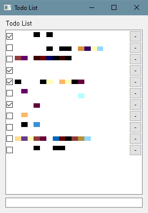

# Todo List Application

This repository contains the code for a simple Todo List application built using Python and PyQt5. The application lets you add, edit, and delete items on a todo list.

## Features
- **Add Todo**: Add new items to the list.
- **Edit Todo**: Double click on any item in the list to edit it (in the empty space).
- **Delete Todo**: Click on the '-' button next to any todo item to delete it.
- **Persistence**: The application stores todo list items on disk in a `todos.txt` file located in the user's home directory. These items are loaded back into the application on startup.

## Prerequisites

- Python 3.x
- PyQt5

The script at the beginning of the code ensures that the PyQt5 module is properly imported from your site-packages directory.

## How to Run

1. Ensure that you have the necessary prerequisites installed.

2. Clone the repository or download the `todo_list.py` file.

3. Run the script with the following command:
    ```
    python3 todo_list.py
    ```

4. The application window will appear, and you can start using the Todo List application.

## Application Screenshot


